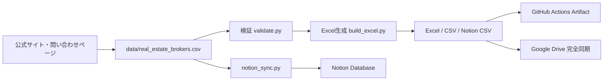

# 日本の不動産取扱業者データベース

関東圏を重点に、北海道から沖縄までの不動産取扱業者を一つのデータベースとして管理するプロジェクトです。特に **戸建て**、**収益不動産**、**問い合わせフォームの有無**、**公式サイトへのハイパーリンク**を重視しています。


> 初期版は公式サイトを根拠に作成した調査済みデータを収録しています。情報は変更されるため、`確認日` と `確認状態` を必ず参照してください。

## 成果物

- `database/real_estate_brokers.xlsx` — 地域別シート、ハイパーリンク、フィルター、固定行、余裕を持たせた列幅を設定したExcelデータベース
- `database/real_estate_brokers.csv` — システム連携用CSV
- `database/notion_import.csv` — Notionインポート用CSV
- `data/real_estate_brokers.csv` — マスター入力データ
- `database/summary.md` — 地域別・取扱区分別の集計

## 主な調査項目

| 区分 | 内容 |
|---|---|
| 基本情報 | 会社ID、会社名、地域、都道府県、本社所在地、営業エリア |
| 取扱物件 | 戸建て、収益不動産、マンション、土地、事業用、賃貸管理など |
| 問い合わせ | フォーム有無、問い合わせURL、電話番号 |
| 根拠 | 公式URL、サービスURL、問い合わせURL、根拠URL |
| 品質管理 | 確認日、確認状態、注意事項、優先度 |

## 使い方

```bash
python -m venv .venv
source .venv/bin/activate  # Windows: .venv\Scripts\activate
pip install -r requirements.txt
python -m real_estate_db.build_excel
```

生成先は `database/` です。

## Notion同期

Notion API 2026-03-11 に対応した同期スクリプトを同梱しています。

```bash
export NOTION_TOKEN="***"
export NOTION_DATA_SOURCE_ID="***"
python -m real_estate_db.notion_sync --input data/real_estate_brokers.csv
```

GitHub Actionsで同期する場合は、Repository Secrets に次の名前だけを登録します。実値をREADMEやコードへ書かないでください。

- `NOTION_TOKEN`
- `NOTION_DATA_SOURCE_ID`

詳しい初期設定は [docs/setup.md](docs/setup.md) を参照してください。

## 自動化

- push / pull request / 手動実行で lint・test・Excel生成
- 毎週月曜日 09:00 JST にExcel/CSVを再生成
- 生成物を GitHub Actions artifact `real-estate-broker-database` として保存
- 生成物に変更がある場合は `database/` へ自動コミット
- GitHubリポジトリ全体をGoogle Driveの `repos/japan-real-estate-broker-database` に同期

## アーキテクチャ



詳細は [docs/architecture.md](docs/architecture.md) を参照してください。

## データ運用ルール

1. 会社情報は原則として公式サイトを根拠にする。
2. URLは必ず `https://` で保存し、Excelではクリック可能なリンクにする。
3. 不明な項目は推測せず `要確認` とする。
4. 更新時は `確認日` と `根拠URL` を更新する。
5. 営業目的で利用する場合は、各社の利用規約・個人情報保護方針・特定電子メール法等を確認する。

## 開発

```bash
ruff check src tests
pytest -q
python -m real_estate_db.build_excel
```

## ライセンス

コードはMIT Licenseです。会社名・商標・各社サイトの情報はそれぞれの権利者に帰属します。
