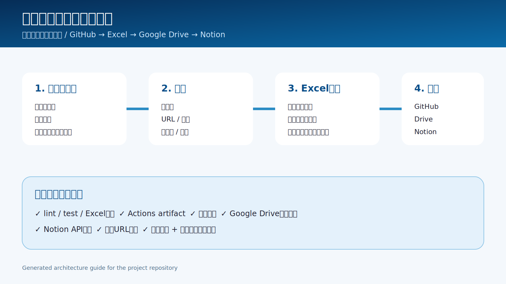
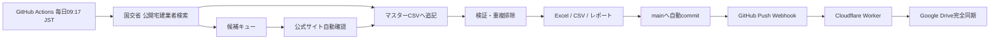

# 日本の不動産取扱業者データベース

関東圏を重点に、全国の不動産取扱業者を**毎日クラウド上で自動発見・追記・更新**するデータベースです。ローカルPCを起動する必要はありません。



## クラウド日次処理

GitHub Actionsの `Cloud daily discovery pipeline` が毎日09:17 JSTに以下を実行します。

1. 国土交通省の公開宅建業者検索から新規候補を取得
2. 関東を高頻度にしながら全国を順番に巡回
3. 会社IDと会社名を重複排除
4. 最大10社をマスターDBへ追記
5. 最大8社の公式サイト・戸建て・収益不動産・問い合わせフォームを確認
6. 未確認候補を翌日以降のキューへ保存
7. Excel・CSV・Notion取込CSV・集計・日次レポートを生成
8. mainブランチへ自動コミット
9. GitHub push webhookでGoogle Driveへ完全同期
10. Notion Secrets設定済みの場合だけNotionへ同期

詳細は [docs/cloud-automation.md](docs/cloud-automation.md) を参照してください。

## 成果物

- `database/real_estate_brokers.xlsx` — 全社一覧、地域別シート、ハイパーリンク、フィルター付きExcel
- `database/real_estate_brokers.csv` — システム連携用CSV
- `database/notion_import.csv` — Notionインポート用CSV
- `data/real_estate_brokers.csv` — マスターDB
- `data/research_queue.csv` — 未調査・再試行・確認済み候補
- `reports/YYYY-MM-DD.md` — 毎日の追加件数・確認件数・警告
- `reports/latest.json` — 最新実行の機械可読レポート
- `state/discovery_state.json` — 地域とページの再開位置

## データ項目

| 区分 | 内容 |
|---|---|
| 基本情報 | 会社ID、会社名、地域、都道府県、本社所在地、営業エリア |
| 取扱物件 | 戸建て、収益不動産、マンション、土地、事業用、賃貸管理など |
| 問い合わせ | フォーム有無、問い合わせURL、電話番号 |
| 根拠 | 公式URL、サービスURL、問い合わせURL、公的登録の根拠URL |
| 品質管理 | 確認日、確認状態、優先度、備考 |

自動追加直後は、公的登録を確認済みでも公式サイトが未特定の場合があります。その行は `確認状態=公的登録確認・公式サイト要確認` とし、根拠URLへクリックできる状態で保存します。公式サイトを確認できた時点で同じ行を自動更新します。

## Google Drive

mainへのpushをGitHub webhookが検知し、Cloudflare Worker経由でGoogle Driveの次のフォルダへリポジトリ全体を同期します。

`repos/japan-real-estate-broker-database`

Excel、CSV、候補キュー、日次レポート、再開状態をすべてDriveへ保存します。

## GitHub Actions

| Workflow | 用途 |
|---|---|
| `Cloud daily discovery pipeline` | 毎日の発見・追記・調査・Excel生成・Drive同期 |
| `CI` | push / pull request時のlint・test・Excel生成 |
| `Publish database manually` | 手動でExcelを再生成 |
| `Sync to Notion` | Notion Secrets設定後の手動同期 |

## 手動実行

Actions画面から `Cloud daily discovery pipeline` を選び、`Run workflow` を押すだけです。1回だけ追加件数や調査件数を変更できます。

ローカル実行も可能ですが、本番運用には不要です。

```bash
python -m venv .venv
source .venv/bin/activate
pip install -r requirements.txt -e .
python -m real_estate_db.cloud_pipeline
```

## テスト

```bash
ruff check src tests scripts
pytest -q
python -m real_estate_db.build_excel
```

## データ運用ルール

1. 公開情報だけを利用する。
2. 公式サイトで確認できない項目は推測せず `要確認` とする。
3. URLはHTTPSを原則とし、Excelではクリック可能にする。
4. 公的検索と公式サイトの双方を根拠URLへ残す。
5. 同一会社を候補IDと正規化会社名で重複排除する。
6. robots.txt、アクセス間隔、レスポンスサイズ上限を適用する。
7. 営業利用時は各社の利用規約、個人情報保護方針、関連法令を確認する。

## アーキテクチャ



詳細は [docs/architecture.md](docs/architecture.md) を参照してください。

## 本番稼働に必要なもの

- GitHub Actionsが有効であること
- 既存のGitHub push webhookとGoogle Drive同期Workerが有効であること
- Notionへ同期する場合だけ `NOTION_TOKEN` と `NOTION_DATA_SOURCE_ID`

日次のGoogle Drive更新にはローカルPC、cron、タスクスケジューラは不要です。

## ライセンス

コードはMIT Licenseです。会社名・商標・各社サイトの情報はそれぞれの権利者に帰属します。
