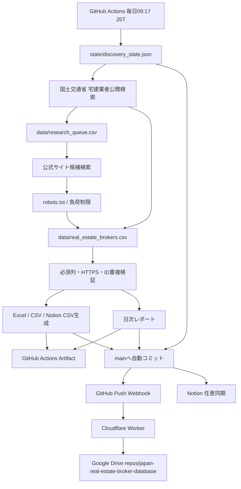

# アーキテクチャ

## クラウド完結の全体像

## 主要コンポーネント

### `mlit_source.py`

国土交通省の公開検索を、都道府県コードとページ番号で少量ずつ巡回します。レスポンスはCP932を含む複数エンコーディングに対応し、免許行政庁・免許番号・会社名を抽出します。

### `enrichment.py`

候補会社の公式サイトを探索し、会社名と不動産関連表記を検証します。ポータル・SNS・電話帳系ドメインを除外し、robots.txt、タイムアウト、最大レスポンスサイズ、アクセス間隔を適用します。

### `cloud_pipeline.py`

候補発見、キュー更新、重複排除、マスター追記、公式サイト確認、Excel生成、状態保存、日次レポート生成を一つのトランザクション的な処理として実行します。

### `state/discovery_state.json`

地域ごとの次ページと巡回位置を保存します。毎日同じ先頭ページだけを調べず、前日の続きから全国を巡回できます。

### `data/research_queue.csv`

未調査・再試行・確認済み候補を保持します。公式サイトが一度見つからなくても削除せず、翌日以降の調査対象として残します。

### GitHub Actions

- `cloud-daily-pipeline.yml`: 日次の主処理
- `ci.yml`: push・PR時のlint/test/Excel生成
- `publish-database.yml`: 手動のExcel再生成
- `notion-sync.yml`: 任意のNotion手動同期

## データライフサイクル

1. 公的登録から候補IDを生成
2. 候補キューとマスターの両方で重複確認
3. 新規行を公的根拠URL付きで追加
4. 公式サイトを検証できたら同じ行を更新
5. 検証済みマスターからExcelを再生成
6. 日次差分をmainへcommit
7. push webhookでGoogle Driveへ完全同期

## 今後の拡張

- 各都道府県宅建協会の会員一覧アダプター
- 行政処分情報の別列・別シート追加
- 公式サイトのリンク死活監視
- 市区町村単位の営業エリア抽出
- LLM API設定時のみ説明文を高精度に要約する任意ステップ
- Notion側の既存行更新を含むupsert
