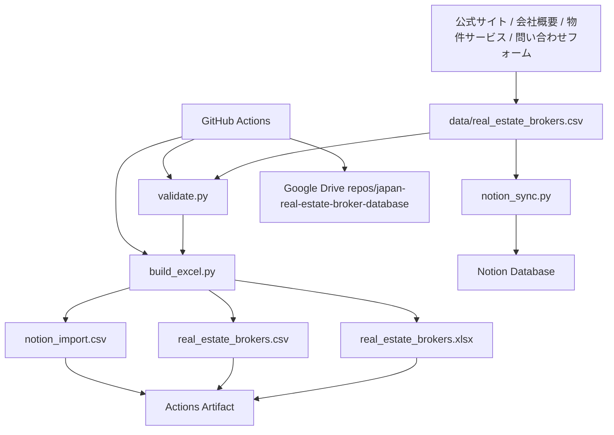

# アーキテクチャ

## 全体像

本プロジェクトは、公式サイトを根拠にしたCSVを唯一のマスターとし、Excel・CSV・Notion向けCSVを再現可能に生成します。

## コンポーネント

### 入力

- `data/real_estate_brokers.csv`: 手作業または調査プロセスで更新するマスター。
- 各行に公式URL・問い合わせURL・サービスURL・根拠URL・確認日を保持。

### 検証

- 必須列の不足
- 会社IDの重複
- HTTPS URL形式
- 地域分類の存在

### Excel生成

- 全社一覧と地域別シートを生成
- 1行目固定、オートフィルター、テーブルスタイル
- 長い会社名・URL・特徴欄に余裕を持たせた列幅
- URL列をクリック可能なハイパーリンクに変換
- データ辞書と集計ファイルを生成

### Notion

- `notion_sync.py` は Notion API `2026-03-11` を使用
- 既存のData Sourceへ各社をページとして登録
- `NOTION_TOKEN` と `NOTION_DATA_SOURCE_ID` はGitHub Secretsで管理

### CI/CD

- `ci.yml`: lint、test、Excel生成、artifact保存
- `publish-database.yml`: 週次または手動で生成物を更新し、差分をmainへコミット
- `notion-sync.yml`: Secrets設定後に手動でNotion同期

### Google Drive

GitHub連携Workerがリポジトリ全体をGoogle Driveのrepo名フォルダへ完全同期します。GitHub Actionsが生成物をコミットすると、Webhook経由でDrive側も更新されます。

## 拡張案

- 公式サイトのリンク死活監視
- 都道府県別の地場業者追加
- 宅建免許番号・設立年・資本金・店舗数の追加
- 問い合わせフォーム項目の比較
- 営業エリアの市区町村粒度化
- 重複会社・ブランド・加盟店の正規化
